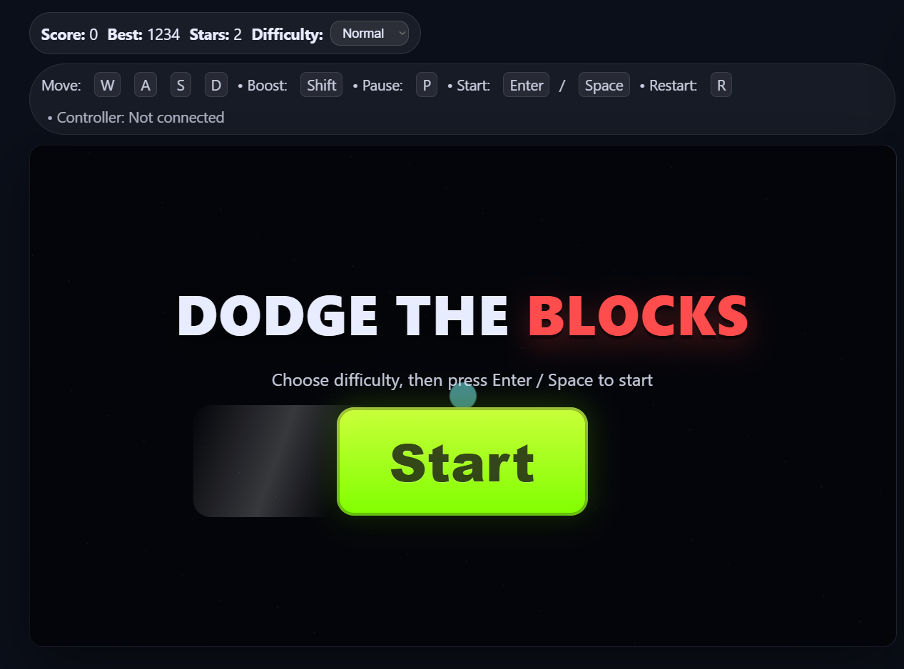
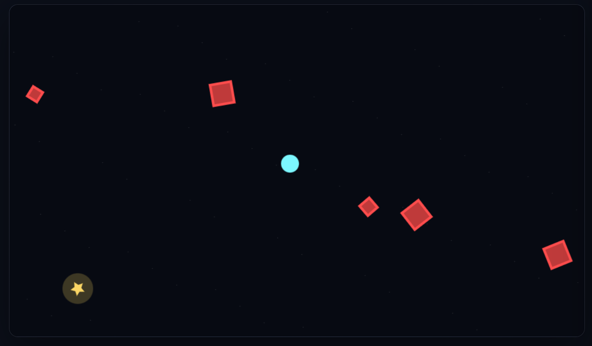
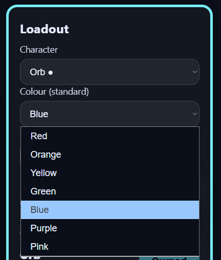
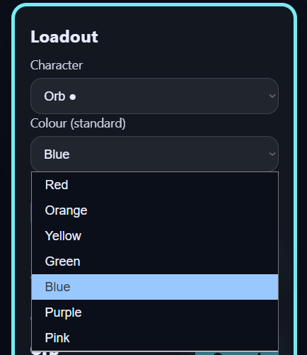
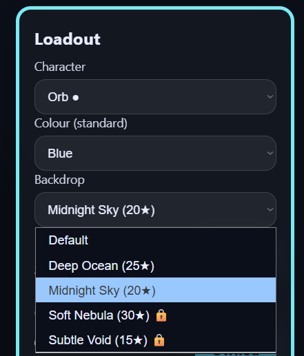
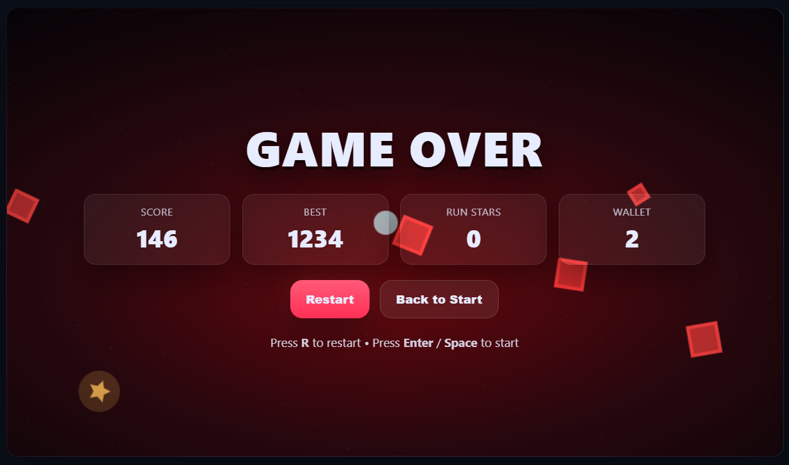

# Dodge the Blocks

A fast-paced browser arcade game where your goal is simple: survive for as long as possible while dodging incoming blocks.

You control your chosen character inside the arena, avoid hazards, collect stars, and build up your wallet to unlock new characters and backdrops. The longer you survive, the higher your score climbs.

## Play the Game

> Add your live game link here
>
> **Play now:** `[Insert live link here]`

## What the Game Is

**Dodge the Blocks** is a reflex-based survival game built for the browser. Players move around the arena, avoid red blocks, collect stars, and make use of power-ups to stay alive longer. The game also includes unlockable cosmetics, backdrop choices, difficulty settings, and saved progress.

## How to Play

- Move using **W, A, S, D**
- Hold **Shift** to boost
- Press **Enter** or **Space** to start
- Press **P** to pause
- Press **R** to restart
- A controller can also be used if connected

Your aim is to:

- dodge incoming blocks
- survive as long as possible
- collect stars during each run
- beat your best score
- unlock new characters and backdrops

## Features

- **Fast survival gameplay** with increasing pressure as the run goes on
- **Three difficulty settings**: Easy, Normal, and Hard
- **Star collection system** that rewards each run
- **Unlockable characters** including Orb, Triangle, Diamond, Hex, Shuriken, Ghost, Rocket, UFO, Football, Basketball, Golf Ball, and Diamond Sword
- **Character colour selection** for the standard shapes
- **Unlockable backdrops** such as Deep Ocean, Midnight Sky, Soft Nebula, and Subtle Void
- **Useful power-ups** including shields, speed boost, double score, slow time, magnet, and shrink
- **Best score and wallet tracking** saved between sessions
- **Fullscreen support**
- **Keyboard and controller support**

## Screenshots

### Start Screen

### Gameplay

### Character Selection

### Colour Selection

### Backdrop Selection

### Game Over Screen

## Why Play It

This game is easy to understand straight away, but getting a high score takes quick movement, good reactions, and smart use of stars and unlocks. It is designed to be simple to pick up, replayable, and satisfying to improve at.

## Built With

- HTML
- CSS
- JavaScript
- Canvas API

## Notes

- Progress is saved locally in your browser
- Some characters and backdrops must be unlocked using collected stars
- Standard shape characters can be recoloured from the loadout panel

